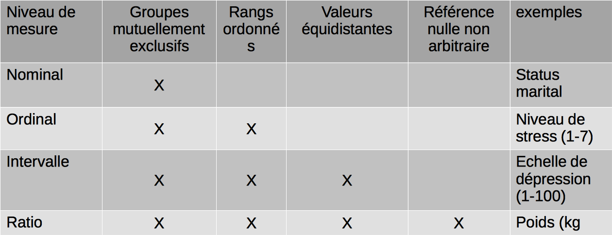
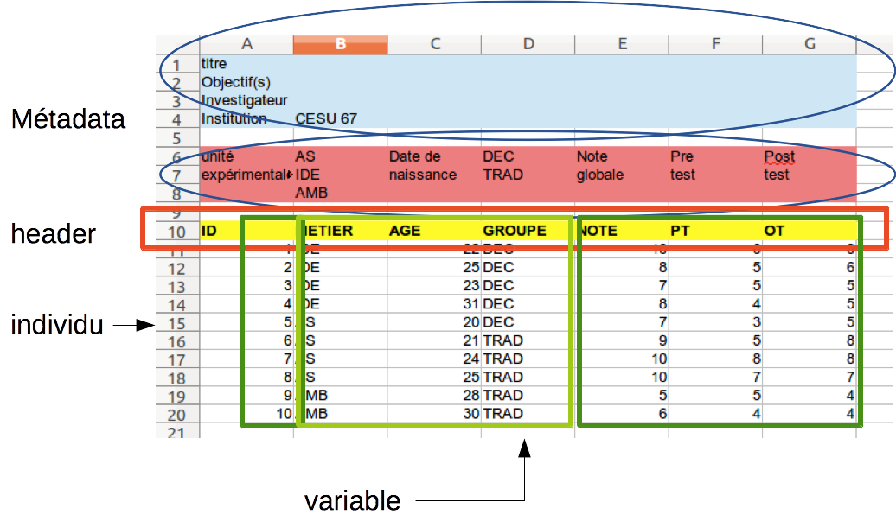

Un travail de recherche peut se résumer à l'équation suivante:
````
Question de recherche + données + analyse (statistique) + publication
```
Le présent chapitre s'intéresse au point 2 et très partiellement au point 3.

Les étapes de l'analyse statistique:

- statistique descriptive: il s'agit de décrire les données au travers de quelques chiffres qui les résument
  - univariée: moyenne, médiane, quantiles
  - bivariée: covariance, corrélation, régression, comparaison de deux moyennes
  - multivarié: ANOVA
- statistique inférentielle: un travail porte toujours sur un échantillon que l'on espère aussi représentatif d'un population que l'on ne connaîtra probablement jamais. L'inférence rassemble les techniques statistiques qui permettent d'extrapoler les conclusins basées sur un échantillon à une population.
- modeélisation

sigma $\sigma, \mu, \sigma^2$


Les données (data) sont le corolaire indiscociable de tout travail de recherche. Elle peuvent exister avant de poser la question de recherche (travail rétrospectif) ou apparaitre après que la question soit poseé (travail prospectif). La nature et la pertinence des données à recueillir relève de la QR. On s'intéresse ici à la gestion de ces données en vue de leur expoitation statitique. C'est un étape cruciale pour deux raisons:

- 80% du temps nécessaire au traitement des données consiste à les rendre "présentables", c'est à dire prêtes à être "moulinées" par un logiciel de statistique. Plus on est pressé plues cette organisation des données est importante.
- une bonne organisation des données permet à un observateur extérieur de comprendre comment le travail s'est construit et au chercheur de reprendre son travail plusieurs mois ou année plus tard sans se demander comment il a pu obtenir ces résultats. Cette attitude "écologique" connait un développement important actuellement sous le nom de "reproductible research". C'est aussi un moyen de contrôler la faude scientifique.

En pratique il faut disposer de trois outils
- un tableur pour saisir les données et faire un premier nettoyage des données.
- un logiciel de statistiques pour exploiter les données.
- un traitement de texte qui à la manière d'un cahier de laboratoire permettra de conserver une trace de toutes les opérations effectuées sur les données (appelé aussi note book ou code book).

Ce sont les mêmes éléments dont aura besoin le statisticien por vous aider à traiter les données:

1. Quelle est la question de recherche ?
2. Les données brutes.
3. les données "nettoyées" ou [tidy data] (http://vita.had.co.nz/papers/tidy-data.pdf)
4. Un lexique décrivant 
  - chaque variable 
  - la fourchette de valeurs possibles
5. La recette que vous avez utilisé pour passer de l'étape 1 aux étapes 2 et 3

Les données brutes
------------------
Syn: raw data, messy data

Il est essentiel d'inclure et de conserver les données sous forme brute (native)
Voici quelques exemples de forme brute des données:

- Fichier binaire fourni par un appareil de mesure
- Un classeur Excel non formaté
- Fichier au format Json fourni par twitter
- Les chiffres saisis à la main tout en regardant à travers un microscope...

Ce sont les données de référence. Il est recommandé de conserver des données particulièrement précieuses sur au moins trois support différents stokés dans des lieux différents. Le format et la nature du support doivent faire appel à des solutions libres pour garantir une pérénité qui ne dépende pas d'un éditeur ou d'une version logicielle. Pour rester exploitables dans le temps quelque soit le support, les données doivent être accompagnées de renseignements très précis sur leur format, comment et quand elles ont été collectées, par qui, lest fourchettes de validité, la signification des abréviations, etc. Ces renseignements indispensables doivent permettre à qelq'un qui n'a pas participé à l'étude de comprendre les objectifs de celle-ci et si les données collectées sont de nature à répondre à la question de recherche. On regroupe toutes ces informations sous le nom de __métadonnées__. La conservation des métadonnées est indiscociable de celle des données.

On reconnait des données brutes sur les éléments suivants:

- L'utilisation de ces données avec un logiciel statistique échoue
- Aucune donnée n'a été manipulée
- Aucune donnée n'a été retirée
- Aucune donnée n'a été résumée de quelque manière que ce soit

Les données nettoyées
---------------------
Syn: tidy data
tidy = rangé, ordonné, utilisable.
messy, messiness = malpropre, désordre

Les principes généraux des tidy data ont été énoncé par 
[Hadley Wickham](http://had.co.nz/) 
dans [ce document](http://vita.had.co.nz/papers/tidy-data.pdf) 
et dans cette [vidéo](http://vimeo.com/33727555).

Elles doivent respecter les principes suivants:

1. chaque variable mesurée doit figurer dans une colonne et une seule
2. Chaque observation différente d'une variable doit figurer sur une ligne différente 
3. une table ne doit comporter qu'un "type" de variable
1. Si plusieurs table sont nécessaires, elles doivent comporter une colonne commune qui permettent de les lier (link).

Le nettoyage des données est parfait si les données peuvent être traitées directement par un logiciel statistique. Un exemple de tidy data sont celles prêtes à l'emploi, que l'on trouve dans les ouvrages de statistique.

Le lexique (code book)
---------------------
Les mesures qui sont faites devront être décrites avec plus de détail que ce qui figure  dans la feuille de calcul . Le lexique contient ces informations . Au minimum, il devrait contenir :

- Informations sur les variables ( y compris les unités !) 
- Informations sur les choix qui ont été faits (1 = homme, 2 = femme)
- Informations sur le protocole de l'étude 
- Comment a été conçue l'étude ?
- Comment a été organisé la collecte de données
- sont-ce les 20 premiers patients rencontrés dans la clinique ? 
- les patients ont-ils été sélectionnés sur certaines caractéristiques comme l'âge ? 
- Les traitements sont-ils attribués au hasard ?

Le format habituel pour ce document est un fichier type taitement de texte (Libre Office, Word) . 
Il devrait comporter deux sections intitulées:

- « Conception de l'étude» qui décrit de façon détaillée la façon dont vous avez recueilli les données . 
- « codage» qui décrit chaque variable et ses unités.

Comment coder les variables
---------------------------


La division des types de données a été proposée en 1946 par le psychologue américain Stanley Smith Stevens
[Stevens 1946](http://www.mpopa.ro/statistica_licenta/Stevens_Measurement.pdf). Accédé le 1/5/2015. Voir aussi [Level of measurement](http://en.wikipedia.org/wiki/Level_of_measurement).

Dans une feuille de calcul, on peut distinguer quelques grandes catégories de données en fonction de leur nature [data type](http://en.wikipedia.org/wiki/Statistical_data_type):

- Continues (quantitatives)
- Discrète (qualitatives)
  - Nominales (catégorielles: sexe)
  - Ordinales (catégorielles ordonnées: échelle de Likert)
  - Intervalles
  - Ratio
- Données manquantes
- Données censurées

variables continues
Ce sont toute variable mesurée sur une échelle quantitative continue comme par exemple le poids mesuré en kg.

Les variables catégorielles comprennent les variables ordinales et nominales.

[variables ordinales](http://en.wikipedia.org/wiki/Ordinal_data) 
sont des variables réparties en niveaux, en nombre limité  (< 100) 
Ces niveaux sont ordonnés et l'ordre à un sens. (exemple une échelle de réponse (Likert): mauvais, passable, bon).

variables nominales [Categorical data](http://en.wikipedia.org/wiki/Categorical_variable) sont des variables où il existe plusieurs catégories, mais qui ne sont pas ordonnées. L'exemple classique est le sexe: homme ou femme.

données manquantes [Missing data](http://en.wikipedia.org/wiki/Missing_data) sont des données manquantes et irrécupérables. Elles sont codées avec le symbole NA (not avalaible).

données censurées [Censored data](http://en.wikipedia.org/wiki/Censoring_(statistics\)) 
sont des données manquantes mais ont sait pourquoi. 
exemple classique:  un patient perdu de vue. 
Ils doivent aussi être codés `NA` quand vous n'avez pas les données. Mais vous devriez également ajouter une nouvelle colonne à vos données appelé, "VariableNameCensored" qui devrait avoir des valeurs de `true` si censuré et `false` si pas. Dans le lexique, il faut expliquer pourquoi ces valeurs sont manquantes. Il est absolument essentiel de mentionner à l'analyste, si il y a une raison connue pour que ces  certaines données soient manquantes.

On ne doit pas supprimer les valeurs manquantes

Cette classification des variables n'a pas seulement un intérêt sémantique. La natured'une variable détermine le choix d'un indicateur ou d'un test. La moyenne n'est utilisable que pour les variables quantitatives alors que la médiane est le paramètre de référence pour une variable catégorielles. Il n'y a de corrélation qu'entre variables continues,alors que le test du Khi2 analyse la relation entre 2 caractères quantitatifs.

Remarques:

- En général éviter de coder variables catégorielles ou ordinales comme des nombres. Lorsque vous entrez la valeur pour le sexe, il devrait être «homme» ou «femme». Les valeurs ordinales dans le jeu de données doivent être "mauvais", "passable", "bon" plutot que 1, 2, 3.
- Cela permettra:

  - d'éviter les ambiguïtés potentielles (calculer un sexe moyen...)
  - et aidera à identifier les erreurs de codage.
- Les logiciels savent très bien manipuler ce type de données

Organiser les fichiers
----------------------

- un dossier principal portant le titre de l'étude
- 3 sous dossiers:
  - __data__
  - __notebook__
  - __stat__
  - __production__

La gestion des données soulève les questions suivantes:

- comment stocker et organiser mes données ?
- comment rendre mes données persistantes ?
- comment partager mes données avec un statisticien?
- comment exploiter statistiquement mes données ?
- comment s'inscrire dans une démarche de recherche reproductible ?

En résumé:

- Données brutes (raw data)
  - Feuille de papier
- Données non préparées (messy data)
  - Données transcrites dans un tableur
  - les entête de colonne contiennent des chiffres au lieu de lettres
  - des variables multiples stockées dans la même colonne
  - les variables sont stockées en lignes et en colonnes
- Données nettoyées (tidy data)
  - 1. chaque variable mesurée doit figurer dans une colonne
  - 2. Chaque observation différente d'une variable doit figurer sur une ligne différente 
- Le passage raw data ->tidy data entraine une altération des données. Il faut toujours fournir:

  - Les données brutes (pour comprendre)
  - Les données nettoyées (pour gagner du temps)
  - La description du processus de nettoyage (quels compromis)

Note book (code book)
---------------------

Anatomie d'un tableur
---------------------

Les données portent généralement sur des mesures appelées __variables__ effectuées sur des __individus__. Les données sont stockées dans un tableau rectangulaire appelé __table__ pour une base de données, __feuille__ pour un tableur, __matrice__ en mathématiques ou __dataframe__ en statistiques.

Par convention[5]:

- chaque ligne du tableau représente un individu unique
- chaque colonne contient les différetes valeurs d'une même variable. 
- une table ne doit contenir qu'un type de données
- si plusieurs tables sont nécessaires, elles doivent inclure une colonne, identique dans chaque table, qui permette de les lier (merging)

C'est une bonne pratique de regrouper les variables:

  - les variables qualitatives (sexe, CSP) appelées aussi __facteurs__ qui permettent de faire des analyses par sous groupes
  - les variables quantitatives (age, notes) qui serviront aux calculs (moyenne)
  
- la première ligne du tableau appelée __header__ contient le nom des colonnes. Dans certains cas il est possible de réserver les premières lignes du tableau pour y noter des informations à propos des varaibles ou de l'étude (métadatas). Cependant cette pratique des à déconseiller au profit du docuent texte associé au tableur (voir le paragraphe notebook)

Ce gabarit doit être bien pensé dès le départ pour éviter toute réorganisation importante par la suite, source d'erreur par confusion des versions.

Règles:

#### Nom de colonnes
AgeAuDiagnostic plutôt que ADx ou tout autre abréviation incompréhensible pour une autre personne.

- une seule ligne. 
- Sert à stocker le nom opérationnel des colonnes. 
Règles:
 - le nom est succinct (5-10 caractères) mais suffisamment explicite
- il ne doit pas contenir d'espace ou de caractères qui pourrait être mal interprété (,;/\)
- préférer les majuscule ou le nom anglais pour éviter d'uiliser des caractères accentuée (firstname à la place de prénom)
- remplacer les espace par des underscore (caractère 8)
- pas de caractères accentués
- ne pas fusionner les cellules: la plupart des logiciels utilisent la première ligne pour déterminer le nombre de colonnes du tableau. Si des cellules sont fusionnées, cela crée une incohérence et le plantage du système.
- Encodage: UTF-8 

Paragraphe sur l'encodage: [Linux magazine]()Massicot Hervé. Démystifier les encodages. Linux pratique (2015), n°89, pp 70-76.

#### les mesures

- toujours utiliser le point décimal (jamais la virgule)
- une colonne ne peut contenir que des chiffres ou du texte, jamais des deux.
- Le dates de préférence au format ISO:
  - AAAA-MM-JJ  ex. 2014-02-06 
  - AAAA-MM-JJ HH:MM:SS ex. 2014-02-06 10:25:36
- Un logiciel ne sait pas distinguer les codes de couleur
- Un logiciel gère très bien les lettres
  - Non: 1, 1, 2, 2, 2, 0, 1, 2
  - Oui: H, H, F, F, F, NA, H, F
- Ne pas mélanger les majuscules et les minuscules
  - Homme <> homme <> HOMME
- Valeur manquante
  - La déclarer explicitement (ne pas laisser de blanc)
  - Ne pas utiliser le zero ou une valeur négative (-99)
  - Valeur par défaut: NA (not avalaible). 

#### les caractères interdits

- les acents
- les blancs: confondus avec les séparateurs de colonne. A remplacer par le caractère _underscore_.
- la virgule: confondue avec les séparateurs de colonne. A remplacer par le point décimal.
- les caractères réservés

#### les autres interdits
- les macros
- la surbrillance ou les couleurs


Astuces

- chercher/remplacer

Petite classification des variables:

- Toutes les variables
- qualitative ou Variable factorielle (sexe, parité) divisées en catégories (levels) mutuellent exclusif
  - nominales (l'ordre n'a pas de sens): sexe, CSP, binaires (fumeur ou non)
  - ordinales (l'ordre à un sens): échelle de Likert, score de Glasgow
- quantitatives: poids, 
  - continue (taille)
  - discrètes (nombre de frères et soeurs)

- les représenter par des caractères alphabétiques plutot que par de chiffres: H ou F est plus explicite que 1 ou 2, sans compter le risque de confusion ou d'erreur d'interprtation (clacul de la moyenne sur le sexe)

Les données manquantes

Ne pas mélanger dans une même colonne des lettres et des chiffres.

Le format csv
--------------
Comment faire communiquer un tableur et un logiciel statistique ?
CSV = comma separated virgule (données séparées par une virgule
Format universel (fichier/enregistrer sous)
Les colonne du tableur sont remplacées par des virgules
Le nom du fichier se termine par .csv
Il existe des variantes (tab,;)
[http://fr.wikipedia.org/wiki/Comma-separated_values]
Le format csv ne connait pas les formats multifeuilles (classeurs). haque feuillet du classeur devra être enregistré séparément.

Le format csv est le moyen le plus sûr de conserver ses données. C'est un format universel que tous les systèmes connaissent aussi bien lecture qu'en écriture. En pratique tout tableur sait exporter ses données dans ce format et sait également importer des données au format csv (aller dans fichier/enregistrer sous). De la même manière, tous les logiciels de traitement statistique savent lire le format csv.

Variantes:`

- CSV comma separated variable
- SSV semicolon separated variable
- TSV tabulation separated variable

Les tableurs
============

Le tableur doit servir à recueillir les données et rien d'autre.

Le cahier de laboratoire ou NoteBook
=====================================


Organiser ses données
=====================

Votre travail de recherche est important et des données bien organisées faciliteront le travail du statisticien et de vos pairs qui doivent pouvoir reproduire et évaluer vos résultats (ref[1]). 

Cycle de vie des données [3]
------------------------
- données brutes (raw data)
- données désorganisées (messy data)
- donnée  nettoyées et exploitables (tidy data)

Carly Strasser et coll.[3] décrivent 8 compOsants
1. planifier
2. collecter: les données sont recueillies à la main ou récupérées via des capteurs et stockées sur un support numérique
3. Vérifier la qualité et l'intégrité des données
4. Décrire: les données sont soigneusement et précisément décrites sous forme de métadonnées standardisées
5. Préserver: les données placées sur un support permettant de les stocker sur le long terme
6. Découvrir: les données potentiellemet utiles sont localiséeset obtenues avec les métadonnées qui les accompagnenet.
7. intégrer: les données provenant de sources disparates sont combinées pour former un ensemble de données homogènes qui puisse être analysé
8. Analyser: analyse des données

Formats de fichier [1]
-------------------
Certains formats de fichiers sont plus adaptés à la conservation que d'autres. Par exemple, certains formats sont propriétaires, ce qui signifie que leur structure ne est pas accessible au public pour la documentation ou la réplication. Si vous enregistrez vos données dans un tel format et que la société qui le détient cesse d'exister, il peut être impossible de les récupérer. 
Idéalement les données:

- doivent rester accessibles dans le futur (20 ans)
- dans un format non propriétaire
- respecter des standards ouverts, documentés
- être commun, utilisé par la communauté de recherche pertinent ou des communautés;
- utiliser des polices de caractère ouvertes et standard (ASCII, Unicode);
- ne pas dépendre d'un support unique pour ^etre affichées ou manipulées.
- si possible ni cryptées, ni compresées.

Les standards ouverts sont par exemple:

- texte: ASCII ou Unicode (UTF8)
- Pour l'audio: MPEG-4, pas Quicktime;
- Pour les images: TIFF ou JPEG2000 ou PNG, (pas GIF ou JPG)
- Pour données structurées: XML, JSON ou RDF (pas SGBDR)
- traitement de texte: libre office (pas Word)
- tableur: libre office (pas excel)

Nommage des fichiers [1]
------------------------
Le nom donné aux fichiers est très important car c'est par cet identifiant que les données sont lues par un logiciel statistique et que l'on peut savoir si la version utilisée est la bonne. Certaines disciplines ont défini des standard très élaborés ([DOE’s Atmospheric Radiation Measurement (ARM) program](http://www.arm.gov/data/docs/plan)).

Voici quelques recommandations:

- Utilisez un système de nommage des fichiers qui reste cohérent.
- la lecture du nom doit ^etre suffisament explicite pour rester comréhensible dutant plusieurs années. Par exemple: projet_questionaire_lieu_date_version.ext
- Évitez ces symboles dans les noms de fichiers: "/ \: *? "<> [] & $. Ces caractères ont une signification particulière dans certains
systèmes d'exploitation d'ordinateur qui pourrait entraîner une mauvaise lecture ou la suppression de ces fichiers.
- évitez les caractères accentués qui sont mal supportés par les logiciels statistiques
- Utilisez le caractère soulignement (_), pas des espaces pour séparer les termes.
- Essayez de garder les noms de dossiers courts (15-20 caractères ou moins) et descriptif de ce qui est à l'intérieur.
- Essayez de garder les noms de fichiers de moins de 25 caractères.
- Inclure les dates dans les noms de fichiers ou de dossiers; utiliser le format AAAA-MM-JJ.
- Si vous ne utilisez pas le versionnage automatique, inclure un numéro de version à la fin du nom de fichier tel que v01. Changez ce numéro de version chaque fois que le fichier est enregistré. Ne utilisez pas d'étiquettes confusion: la révision, finale, final2, etc.
- Pour la version finale, remplacer le dernier mot pour le numéro de version. (Ceci est particulièrement important si les fichiers sont partagés.)
- Les noms de fichiers doivent contenir qu'un seul point, avant l'extension de fichier (par exemple name_paper.doc PAS name.paper.doc)

Sauvegardez vos données [1]
-----------------------

Il est généralement conseillé de faire trois copies de vos données. Par exemple, vous pourriez avoir le jeu original, une copie sur un disque dur externe local, et une autre copie sur un disque externe situé ailleurs. Ces copies doivent avoir des localisations géographiques différentes. Assurez-vous que le système de back-up est fiable et que les données sont réllement récupérables. Le "Cloud" est une solution envisageable (Google drive, Bit Bucked).

Sécurisez vos données
---------------------
En général le cryptage des données n'est pas conseillé. Cependant il peut ^etre indispensable pour certaines données sensibles (données nominatives, personnelles, recommandation de la CNIL) de les crypter. Gardez des mots de passe et les clés sur le papier (2 exemplaires), et dans un fichier numérique crypté comme PGP (Pretty Good Privacy).
     Ne comptez pas sur le cryptage 3ème partie seul.

Il est également recommandé de stocker des données dans un format non compressé. Si vous avez besoin d'économiser de l'espace, nous recommandons de limiter la compression à votre copie de sauvegarde.


Utiliser un tableur [2]
===================
    
Les données sont généralement conservées sur 2 types de support, les tableurs et les bases de données. Il est aisé de passer de l'un à l'autre. Le tableur est la solution unervesellement adoptée du fait de sa disponibilité immédiate et de son utilisation intuitive. Cependant un certain nombre de règles doivent ^etre respectées.

La première (et très importante): un tableur doit servir à saisir des données et ne servir qu'à cela. La plupart des ennuis commencent lorsqu'on pense qu'un tableur peut tout faire, en particulier des statistiques. Il faut abandonner cette idée et se placer uniquement sous l'angle de la saisie des données. Pour faire des statistiques, il y a des logiciels pour celà.

Anatomie d'une feuille de calcul
--------------------------------
L'organisation des données dans une feuille de calcul pour qu'elle puissent être traitées immédiatement par logiciel de statistiques est une opération semée d'embuches, si on ne respecte pas quelques règles de base.



Une feuille est constituées de __cellules__ délimitées par des __lignes__ et des __colonnes__ formant un tableau rectangulaire où:

- chaque colonne ne doit contenir qu'une et une seule variable.
- chaque ligne ne concerne qu'une et une seule observation
- le total des lignes doit être égal au total des observation + 1 (header)

La conséquence immédiate de la règle 2 est que les données ne doivent pas être grouppées.

La feuille de saisie est divisée en 3 zones horizontales:

- la première, __facultative__, sert à stocker les métadonnées [http://fr.wikipedia.org/wiki/M%C3%A9tadonn%C3%A9e]. Sa présence est à éviter (utiliser un document annexe) et sera éliminée au moment de l'analyse.
- la seconde stocke le nom des colonnes: c'est l'__en-tête__ ou __header__.
- la troisième contient les données proprement dites.

La troisième zone est divisée verticalement en 2:

- les colonnes les plus à gauche contiennent les variables de type "facteur" (factorielles: profession, type de pédagogie)
- les colonnes les plus à droite contiennent les mesures

Métadonnées [A Gentle Introduction to Metadata ](http://www.language-archives.org/documents/gentle-intro.html)Jeff Good University of California, Berkeley. Accédé le 28/4/2015
ce sont des données à propos des données.
Elles servent à comprendre le contexte dans lequel se fait l'étude:

- nom de l'auteur, des investigateurs
- version du questionnaire
- méthodes de description des variables: 'pour la rubrique sexe préciser H ou F'. 

En pratique il est recommandé de ne pas faire figurer cette zone dans le tableur mais de les faire figurer dans un document annexe comme le __dictionnaire__ pour la description des données et le __notebook__ pour expliquer comment les données ont été recueillies,par qui, dans quelles conditions, etc.

Le nom des colonnes (header)
-------------------
- une seule ligne. 
Sert à stocker le nom opérationnel des colonnes. 
Règles:
le nom est succinct (5 caractères)
il ne doit pas contenir d'espace ou de caractères qui pourrait être mal interprété (, ; / \ @ &)
remplacer les espace par des underscore (caractère 8) : Ceci_est_un_exemple
pas de caractères accentués
Encodage : UTF-8
Ne pas fusionner les cellules  

Les pièges à éviter
-------------------

NETTOYER LES DONNÉES [5]
========================
Il n'y a que dans les ouvrages de statistique où l'on trouve des données prètes à être analysées. Dans un travail de recherche les données passent par plusieurs états avant de  pouvoir être analysées:

1. les données brutes (raw data): c'est la saisie initiale de l'expérimentateur. Il manque souvent le header, certains type de données sont erronés, erreur de catégorisation des données, caractère mal encodé ou inconnu (caractères accentués, réservés), etc. La lecture directe de ces données par un logiciel de statistique échoue.

2. les données techniquement correctes: ce sont des données brutes corrigées de sorte qu'elle sony techinquement acceptables par un programme de traitement. Les "dirty data" sont transformées en "messy data" (données propres):
- données manquantes: il manque toujours des données... Chaque fois que c'est possible essayer de retrouver la donnée. Si la donnée est irrécupérable, la remplacer par un symbole compréhensible par le logiciel statistique comme NA (Not Avalaible). Ne jamais laisser une case vide. Eviter les symboles qui prêtent à confusion: 0, 99999, -1, etc. Ne pas confondre NA et Inconnu ou NSP (ne sais pas) ou NSPR (ne souhaite pas répondre). Ne pas supprimer des observations parceque des données manquantes.
- données spéciales: concernent surtout les valeurs numériques pour les nombres n'appartenant pas à l'ensemble des réels: NA, NaN (not a number), Inf.
- données extrèmes (outliers)

3. Données cohérentes: dans cette dernière étape on vérifie la cohérence des données techniquement correctes. Par exemple qu'il n'existe pas d'age négatif ou supérieur à une certaine limite, une pathologie incompatible ave un sexe donné. Cette étapepeut se révéler particulièrement fastidieuse et complexe.

Ce n'est qu'à la fin de cette troisième étape que les données peuvent être soumises à une analyse statistique.

2 remarques:
- ces trois étapes doivent faire l'objet de trois fichiers distincts afin de pouvoir revenir en arrière en cas de problème.
- toutes les étapes doivent être documentées pour comprendre quelles manipulations ou transformations ont été néccessaires pour passer de l'une à l'autre

Quand utiliser une démarche quantitative ?
==========================================

La recherche qualitative s'intéresse aux données mesurables sur lesquels on peut appliquer des méthodes statistiques pour les décrire, les comparer, les inférer (Tirer une conclusion d’une proposition ou d’un fait, etc. [wikitionnaire](http://fr.wiktionary.org/wiki/inf%C3%A9rer)) ou les modéliser.

inférence: estimer les paramètres d'une population à partir d'un échantillon. La précision de l'estimation dépend de la taille de l'échantillon. Inversement, si on fixe la précision souhaitée on peut déterminer la taille l'échantillon. D'une manière générale, pour doubler la précision (cad diviser par 2 l'intervalle dans lequel se trouve le paramètre d'intérêt), il faut quadrupler la taille de l'échantillon.

modélisation: c'est trouver la meilleure combinaison possible de plusieurs variables pour prédire le comportement d'une variable d'intérêt. Par exexemple quelle sont les chances qu'une personne se plaignant d'une douleur thoracique soit porteuse d'une pathologie coronarienne sachant que l'on a mesuré chez eelle un certain nombre de variables (sexe, age, poids, taux de cholestérol, etc.) dont on a montré préalablement (par les méthodes statistiques précédentes) qu'elles avaient un lien avec la pathologie suspectée.
Il existe de nombreuses techniques de modélisation. L'une des plus répendue est le modèle linéaire.
